# m2

Reference text: four protocol documents for m2, a
manager-of-managers way to run coding agents from one plan
file. The documents depend on companion protocols,
repository tooling and a plan store that are not included,
and no m2 run is evidenced here.

m2 ships four protocol documents and no runnable code.

<picture>
  <source
    media="(prefers-reduced-motion: reduce)"
    srcset="assets/poster.svg"
  />
  
</picture>

The demo shows the output of a packaging test, not a run of
m2. It is reconstructed from
[`evidence/transcripts/package-check.txt`](evidence/transcripts/package-check.txt),
the recorded output of
[`tests/test_package.py`](tests/test_package.py).

**Not measured, stated up front.**

- No m2 run produced the evidence here. No conductor,
  manager lane, worker or reviewer was started, and no part
  of the protocol was executed.
- Whether an agent that reads these documents follows them
  has not been measured.
- The documents were written for one repository. Whether
  they work in another one after the placeholders are filled
  in has not been tested.
- Nothing here checks a record against the artifact schemas.
- Neither Claude Code nor Codex was started to confirm that
  the invocation names below resolve.

## What the claim covers

In the claim, m2 is the skill package under
[`skills/m2/`](skills/m2/), which is what both install
blocks copy. Its six files are Markdown or YAML. The
packaging test checks that none of them is executable, opens
with a `#!` line, or has another suffix. The documents do
quote shell commands and a pseudocode loop as text.

The repository around the package also holds Python scripts
that record the transcript, build and check the images, and
test the packaging. They are not part of the skill.

## What is in it

- [`skills/m2/SKILL.md`](skills/m2/SKILL.md) says what m2
  is and points at the four documents.
- [`skills/m2/references/m2.protocol.md`](skills/m2/references/m2.protocol.md)
  is the conductor protocol: the invocation contract, the
  budget and exit contracts, the tick loop, the execution
  phases, the output schemas, and the status and failure
  rules.
- [`skills/m2/references/m2-artifact-schemas.md`](skills/m2/references/m2-artifact-schemas.md)
  lists required fields for records the conductor protocol
  uses. It does not cover every record and field that
  protocol names; see the known disagreements below.
- [`skills/m2/references/m1.protocol.md`](skills/m2/references/m1.protocol.md)
  is the protocol for one manager lane.
- [`skills/m2/references/writeAC.protocol.md`](skills/m2/references/writeAC.protocol.md)
  is the protocol for turning a request into acceptance
  criteria.

In the documents, `m2` means manager of managers and `m1`
means manager of individual contributors.

## Not included

The documents name things you cannot get from here:

- **Companion protocols.** `l8()`, `fanOut()`, `dispatch()`,
  `green()` and `greenTick()` are called by name. None of
  them ships in this repository.
- **Repository tooling.** The documents expect the
  repository they run in to have an `AGENTS.md`, documented
  lint, prepare and verify commands, a devcontainer command
  surface, and the `git` and `gh` commands. They read an
  optional `M2_RUNS_ROOT` environment variable. The
  `x_available` field of the Isolation Record refers to a
  repository command runner named `x`, which is not
  included.
- **The original repository's stack.** Some passages assume
  it without naming it: Bazel outputs, C++ formatting,
  `node --check`, Playwright, and browser evidence for a
  product with a canvas and a renderer. Read those as
  examples from one repository.
- **A plan store.** Plans live in a separate git repository.
  The documents write it as `~/<plan-store>`, with the
  identities `<owner>/<plan-store>` and
  `<owner>/<project-store>`. Those, and `<repository>`, are
  placeholders that stand for names in the original
  repository.
- **A model.** The documents name `gpt-5.3-codex-spark` as
  the default worker model. This repository provides no
  model and no access to one.

## What changed from the original

The four documents come from a private repository. For this
release:

- the four files lost the `.gpt.` infix in their names and
  moved under `references/`;
- pointers to the sibling protocol files now read
  `references/...`, `M2_SCHEMA_PATH` became relative to the
  skill's directory instead of the repository root, and the
  pointer to the `l8()` protocol file became its name;
- the plan store path and the two repository identities
  became the placeholders above;
- commands specific to the original repository became "the
  repository's documented" lint, prepare and verify
  commands, and two `gh` commands lost their `--repo`
  argument;
- two fixed checkout paths, one named caller and one test
  command name were replaced with general wording;
- one product URL became `https://example.com/`;
- in `m1.protocol.md`, an example path that named a project
  was replaced, a feature example was shortened, and the
  top-level name in a source directory example was replaced.

`writeAC.protocol.md` is unchanged. Names the documents
define for a run are also unchanged: the run-time paths
under the repository's `.agents` directory (logs, runs,
projects, teams, docs and local files), the `.gpt.md`,
`.gpt.json` and `.gpt.jsonl` artifact names, and the
`.plan.m2.gpt.md` plan suffix. `.gpt.` is an infix the
original repository puts in the names of files an agent
writes.

## Known disagreements in the documents

The documents are shipped as written. They do not fully
agree with each other or with themselves, and this release
does not settle any of it. Known cases:

- `m2-artifact-schemas.md` has two sections titled
  "Non-Stopping Delivery Event Record" with different
  required fields. Neither lists
  `auto_generated_pr_query_clean`, which the protocol asks
  every delivery event to record. The `kind` values in the
  second do not cover screenshot, browser-proof or
  deploy-proof events, which the protocol counts as delivery
  events. One passage says `delivery_event_is_nonterminal`
  must be `true` for every budgeted-run event and another
  allows `false`.
- The schemas file has no record for the manager output the
  protocol points it at, and none for the resume pointer.
  Its Resume Prompt Record lacks `plan_store_identity`,
  `plan_source_commit` and `plan_blob_id`, which the
  protocol says to persist. Its `event_type` values lack
  `acceptance_matrix_revision` and `early_stop_violation`,
  which the protocol's loop appends. It lists
  `execution_intent` as required where the protocol gives it
  a default.
- The protocol's Final Response Gate lists six statuses and
  leaves out `green_tick_handoff`, which its bounded green
  tick section and the schemas file use. Its turn-based
  continuation section allows a final message in three
  cases and leaves out the overrun handoff and the green
  tick handoff that other sections allow.
- The derived value `RUN_EFFECTIVE_BUDGET_MINUTES` takes the
  larger of the duration and the tick equivalent with no
  exception, while the aggregate M1 passages keep the
  duration as the wall-clock basis.
- The worker output schema says integration may use only
  accepted diff artifacts, while the worktree contract and
  Phase 6 also accept worker commits and same-thread
  changes.
- `RUN_HEALTH_DASHBOARD_PATH` is defined twice with
  different values.
- "Tick Eligibility Checklist" names no section; the
  schemas file has a Tick Eligibility Record.
- The compatibility syntax line omits `numM1s`.
- "Do not use destructive git commands" stands beside a
  recovery path that resets a branch and force-pushes with
  lease.
- `writeAC.protocol.md` lists the accepted form
  `writeAC(text)` twice.

This list is what review of this release found. It is not
claimed to be complete.

## Use it

Read
[`skills/m2/references/m2.protocol.md`](skills/m2/references/m2.protocol.md)
before you install the skill. It tells an agent to keep
working without returning control to you; to commit, push,
and open, update or merge pull requests; to write outside
the repository it was started in; and to treat a saved
resume prompt as its prompt. [`SECURITY.md`](SECURITY.md)
lists these. Both installs below are pinned to a tag rather
than to `main`.

### Claude Code

Save this as `install.sh` and run it with `sh install.sh`.
It sets `set -eu` and an `EXIT` trap, so pasting it straight
into an interactive shell will end that shell if the clone
fails.

```sh
set -eu
release=v0.1.0
install_target="$HOME/.claude/skills/m2"
install_parent="$(dirname "$install_target")"
mkdir -p "$install_parent"
install_tmp="$(mktemp -d "$install_parent/.m2.XXXXXX")"
install_stage="$install_tmp/package"
rollback_install() {
  if [ ! -e "$install_target" ]; then
    if [ -e "$install_tmp/previous" ]; then
      mv "$install_tmp/previous" "$install_target"
    fi
  fi
  rm -rf "$install_tmp"
}
trap rollback_install EXIT
git clone --quiet --depth 1 --branch "$release" \
  https://github.com/trycopilotai/m2 \
  "$install_tmp/clone"
mkdir -p "$install_stage"
cp -R "$install_tmp/clone/skill/." "$install_stage/"
if [ -e "$install_target" ]; then
  mv "$install_target" "$install_tmp/previous"
fi
mv "$install_stage" "$install_target"
trap - EXIT
rm -rf "$install_tmp"
```

The name to invoke is `/m2`. As stated above, that was not
confirmed in a running Claude Code.

### Codex

Save this one the same way. The only line that differs from
the block above is `install_target`.

```sh
set -eu
release=v0.1.0
install_target="$HOME/.agents/skills/m2"
install_parent="$(dirname "$install_target")"
mkdir -p "$install_parent"
install_tmp="$(mktemp -d "$install_parent/.m2.XXXXXX")"
install_stage="$install_tmp/package"
rollback_install() {
  if [ ! -e "$install_target" ]; then
    if [ -e "$install_tmp/previous" ]; then
      mv "$install_tmp/previous" "$install_target"
    fi
  fi
  rm -rf "$install_tmp"
}
trap rollback_install EXIT
git clone --quiet --depth 1 --branch "$release" \
  https://github.com/trycopilotai/m2 \
  "$install_tmp/clone"
mkdir -p "$install_stage"
cp -R "$install_tmp/clone/skill/." "$install_stage/"
if [ -e "$install_target" ]; then
  mv "$install_target" "$install_tmp/previous"
fi
mv "$install_stage" "$install_target"
trap - EXIT
rm -rf "$install_tmp"
```

The name to invoke is `$m2`. That was not confirmed in a
running Codex either.

Each block works in a temporary `.m2.*` directory beside the
target and removes it on exit. An existing install at the
target is replaced.

While it clones, `git` warns that the tag "is not a commit"
and notes a detached `HEAD`. Both are expected for a clone
pinned to an annotated tag.

Both blocks copy through `skill/`, a symlink to
`skills/m2/`, so the installed directory holds `SKILL.md`,
`agents/` and `references/` as real files. They assume a
checkout that keeps symlinks; with `core.symlinks` off the
copy fails and the block rolls back. The repository
also carries `.claude-plugin/plugin.json` and
`.codex-plugin/plugin.json` for a marketplace. No
marketplace lists this skill, so no marketplace install is
described here.

## Evidence

`evidence/transcripts/package-check.txt` is the recorded
output behind the claim at the top of this file. It is the
output of `python3 tests/test_package.py -v`, run in a
throwaway directory that held a copy of `skills/` and of the
test. `scripts/record_session.py` wrote the `$` lines and
the exit status; the rest is the test's output, with one
edit: the elapsed time that unittest prints after the test
count was removed. The transcript itself carries no notice
of that. `evidence/demo-manifest.json` is where the edit is
declared, as `strip-test-duration`, beside the SHA-256 of
`SKILL.md`, of `agents/openai.yaml`, of the four documents
and of the test, the command, the interpreter, the date, and
the SHA-256 of the transcript.

This is evidence about the files in the package. It is not
evidence that the protocol works.

`make check` runs the packaging test and a second suite that
ties this file, both plugin manifests, the transcript and
the demo images to each other.

## Contributing

See [`CONTRIBUTING.md`](CONTRIBUTING.md).

## Security

See [`SECURITY.md`](SECURITY.md).

## License

MIT. See [`LICENSE`](LICENSE).

## Not affiliated with GitHub or GitHub Copilot

The `trycopilotai` organisation name is not a claim of any
relationship with GitHub Copilot. This project is not
affiliated with, endorsed by, or sponsored by GitHub, Inc.
GitHub and GitHub Copilot are trademarks of GitHub, Inc.
